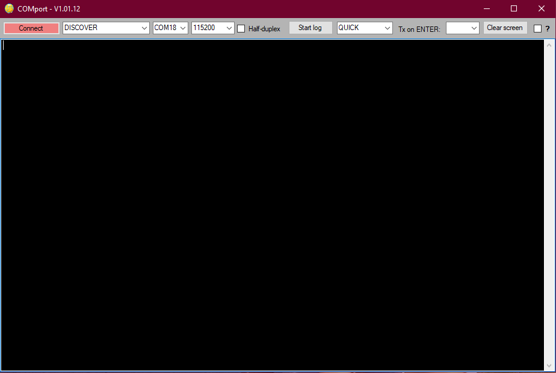
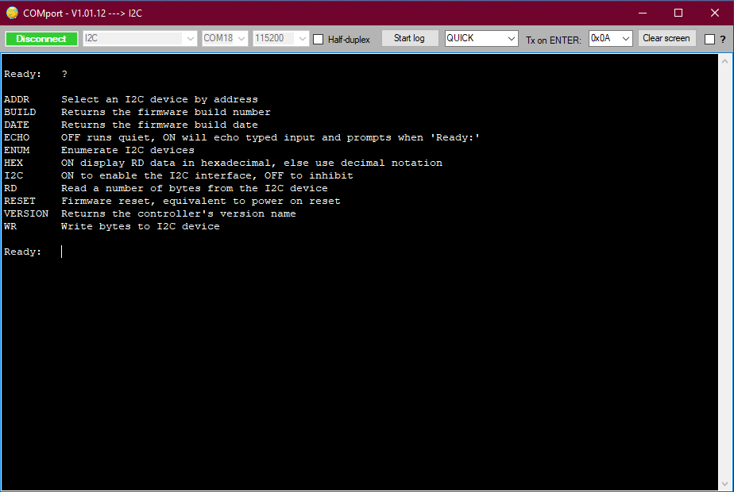
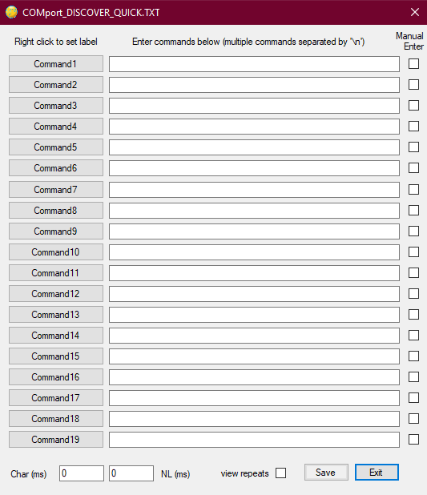

# Introduction 
This is a simple COM port application geared up to the Foster & Freeman products.  On entry, there is a bold Connect/Disconnect button with the product name and baudrate next to it.

# Getting Started
1. Copy the files from bin\Release directory to your C:\WorkArea
2. Create a shortcut to ProjectRelabel.exe on your desktop
3. Product names, baudrates and commands for getting product ID are held in COMport.TXT
4. Start the application using the shortcut
5. Select the product and port from their drop-down boxes
6. The baudrate should be filled in by the contents of COMport.TXT
7. Click on the Connect button and wait for the button to go green
8. Now type into the large black console area to communicate with the connected device

#QUICK text menu

* Click on the QUICK text entry to bring up a sheet of 19 entries
* Click on the drop-down icon for QUICK text to list available menus
* Select the "new sheet" item and type in a name to create a new sheet 
* Each entry has a command button on the left, user's text in the middle and manual tick box to the right
* Fill in the user text with frequently required items
* Click on a command button to quickly generate the user's text as though typed into the console area
* If the manual box is not ticked, an automatic ENTER is generated
* Changes to these items are only recorded on hitting the Save button
* Inter-character delays can be set in milli-seconds
* A delay can also be introduced after each new line
* Tick "view repeats" to reveal extend commands at the bottom of the menu
* The repeat button means that the next command hit will be repeated at the rate selected

# COMport projects

The file COMport.TXT lists common Foster and Freeman projects that can communicate with a console application.  This proves a single line of parameters for each project available listing name, baud-rate and options such as half-duplex and expected ENTER characters.

# Build and Test

* Use Visual Studio 2019 to open the solution file (sln)
* Select Release in Solution Configuration
* Do Build\Rebuild Solution
* Execute the exe found in bin\Release directory

# Recent updates

V1.01.12 - 24.04.2023

1. Implement Ctrl+C and Ctrl+V for copy and paste.
2. Rename COMport.csv to COMport.TXT
3. Drop the old enviroment variables altogether.
4. Improved inter-character delay handling.
5. Check if save is required on exiting QUICK text menu.

V1.01.11 - 21.04.2023

Switch the COMport_quickTextName_project.TXT to COMport_project_quickTextName.TXT

V1.01.10 - 18.04.2023

1. Changed QUICK text menu button to drop down to select a file (currently COMport_quickTextName_project.TXT).
2. Label on execute buttons in quick text can be modified.

V1.01.09 - 24.02.2023

1. Correction to CR from quick text (V1.01.08 didn't use the NL delay on quick text).
2. Each project can save its own Quick Text file.
3. Last connection made for each project is saved in the user's local file.

V1.01.08 - 21.02.2023

1. Timer now takes decimal interval rather than just whole seconds.
2. Character and newline delays are updated by selecting a new project.

Earlier updates . . .

1. Add quick text boxes hidden off on far right.
2. Move quick text into a sub-menu by itself - this can be positioned anywhere on the screen.
3. Extend the number of quick text boxes, change back to Execute button and add log option.
4. Add repeat command buttons off the bottom of the quick text menu.
5. Disconnect if serial device fails.
6. More option at the bottom of Quick Text menu.
7. Drop environmental values in favour of file storage.

